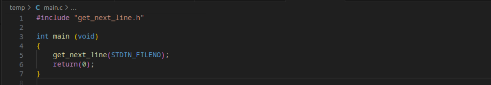

<!-- PROJECT LOGO -->

<br />
<div align="center">
  <a href="https://github.com/sebastianpenning/get_next_line">
    
  </a>

  <h3 align="center">get_next_line</h3>

  <p align="center">
    get_next_line is about getting a line from a file descriptor
    <br />
    <a href="https://github.com/sebastianpenning/get_next_line">
  </p>
</div>


<!-- ABOUT THE PROJECT -->

# About The Project

  
get_next_line is a project at Codam that teaches you about static variables, file descriptors, and how to mitigate memory leaks.


# Built With

* [![C][C]][C-url]

<!-- GETTING STARTED -->

# Getting Started

  

This is an example of how you may give instructions on setting up your project locally.

To get a local copy up and running follow these simple example steps.


# Installation
1. Clone the repo


```sh

git clone https://github.com/sebastianpenning/get_next_line.git

```
2. cd into directory

```sh

cd get_next_line

```

<!-- USAGE EXAMPLES -->

1. Include get_next_line.h file and get_next_line function in project.

<a href="https://github.com/sebastianpenning/get_next_line">
  
</a>


2. Compile with cc

```sh
cc -Wall -Werror -Wextra {project_files.c} get_next_line.a && ./a.out
```


<!-- LICENSE -->

# License

Distributed under the MIT License. See `LICENSE.txt` for more information.


<!-- ACKNOWLEDGMENTS -->

# Acknowledgments

* [Codam](https://www.codam.nl/about-codam) 


<!-- MARKDOWN LINKS & IMAGES -->

<!-- https://www.markdownguide.org/basic-syntax/#reference-style-links -->

[license-url]: https://github.com/sebastianpenning/get_next_line/blob/main/LICENSE

[C]:https://img.shields.io/badge/-c-black?logo=c&style=social

[C-url]: https://www.learn-c.org/
  

